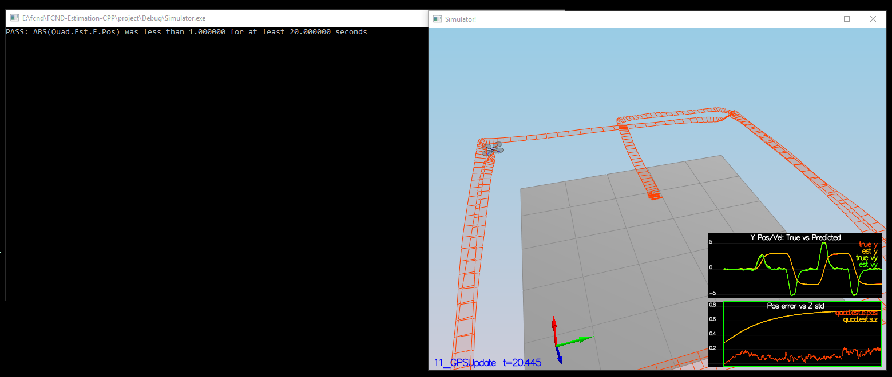

# Writeup Estimation

## Step 1 Sensor Noise - Calculation of Standard Deviation

After firing up the scenario the graph logs were put into excel. The standard deviation has been calculated with the formula of stabw over all trackpoints.
`0_SensorNoise.txt` has been edited to reflect the calculated values.
Firing up the simulator on scenario 6 show a pass for both.

## Step 2 Attitude Estimation

The task was to improve attitude errors. Sensor for this time was IMU only. Noise levels have been set down to 0.

It was required to implement a better rate gyro attitude integration scheme in `QuadEstimatorEKF.cpp` at function `UpdateFromIMU()` to reduce the errors in the euler angles (attitude).

As favored in the description, quaternions were used as the internal methods simplify the maths.

## Step 3 Prediction State

Scenario `08_PredictState` is using a perfect IMU. For solving the task of a bad accelerometer update, `QuadEstimatorEKF.cpp` function `PredictState()` had to be implemented according the transition model in the lessons:

### Scenario 8:

For prediction we also need g Prime, by taking the jacobian:

Final we can predict on `Predict()` for covariance and gPrime:

Tuned `QPosXYStd = .03`and `QVelXYStd = .11`:

### Scenario 9:

## Step 4 Magnetometer Update

### Scenario 10:

First we need to tune `QYawStd` to capture approximately the magnitude of the drift.
It has been set to `QYawStd = .06`:

To get the error to less than 0.1rad, the function `UpdateFromMag()` was implemented.

After update the test failed first, as already mentioned under tasks, but tuning again to `QYawStd = .08` made it pass:

## Step 5 GPS Update

### Scenario 11:
GPS was the last to implement for the working estimator:

The quad followed the trajectory, slow, but stable.

## Step 6 Own Controller

Last but not least the very own controller comes into the picture.

Other than expected it ran right away successful, no need to tune. Great!

